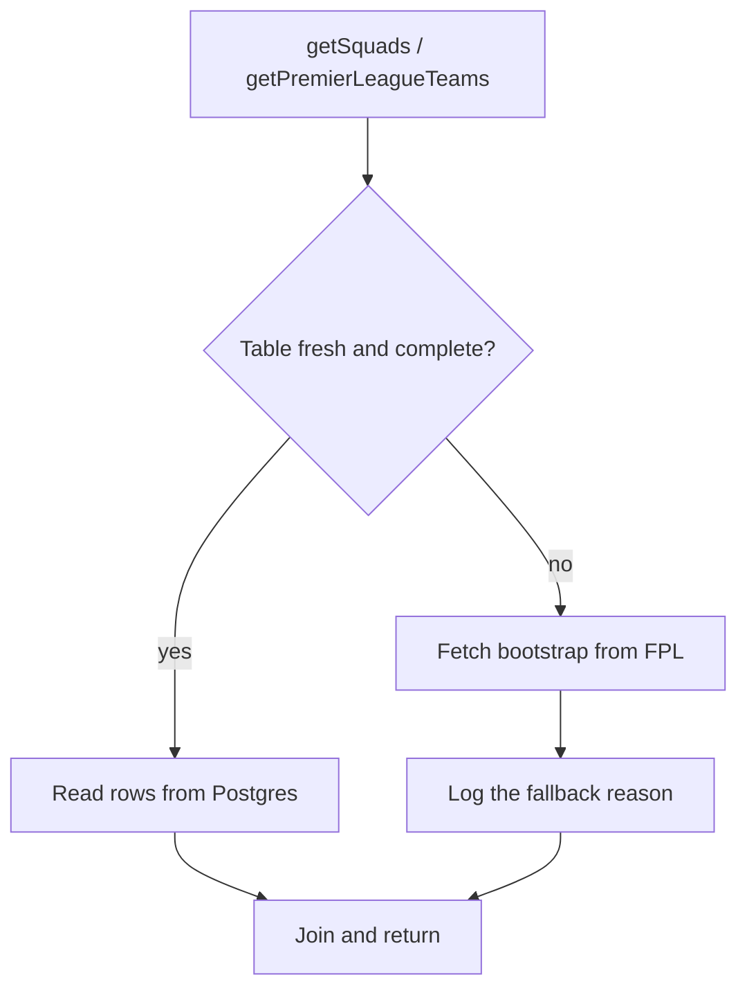
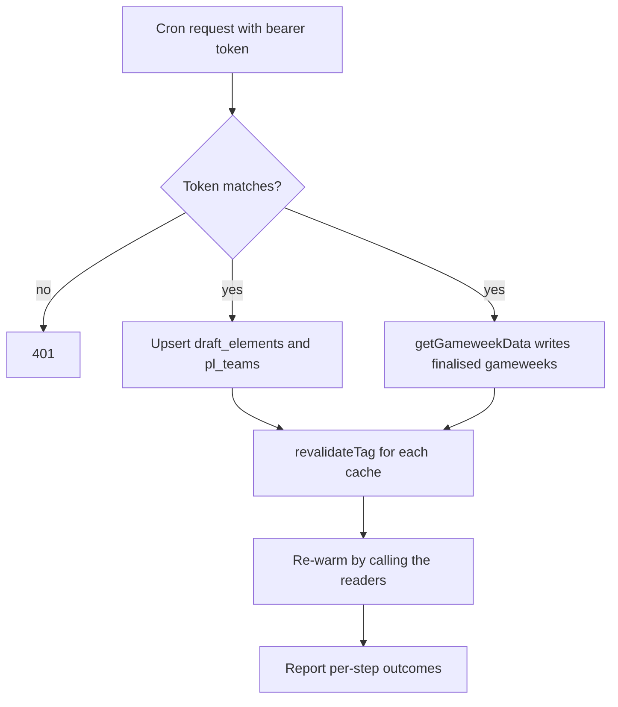

# Database Reference Cache and Sync Job - Plan

## Goal Capsule

- **Objective:** serve footballer and club reference data from Postgres instead of re-downloading the two FPL bootstraps on every cold read, and grow the nightly cron from a cache-dropper into a sync job that keeps those tables current.
- **Authority:** `agents/AGENTS.md` is the law and outranks this plan. Where they disagree, stop and raise it. `agents/API.md` owns upstream payload shapes; `agents/ARCHITECTURE.md` owns where code lives.
- **Execution profile:** a schema migration, two DAL modules, a pure mapping layer with tests, two read-path rewires, and one route change. Land it as one branch off `main`.
- **Stop conditions:** stop and ask if the migration would touch `neon_auth`; if a read path cannot fall back to the API; or if the sync would write a row without a `league_id`.
- **Tail ownership:** the implementer owns branch, commits and PR. This plan does not prescribe them.

---

## Product Contract

### Summary

Add two reference tables — `draft_elements` (footballers) and `pl_teams` (the 20 clubs) — a DAL to read them, and read paths that fall back to the FPL API when a table is empty or stale. Extend `/api/cron/revalidate` into a sync job that refreshes both tables, finalises any completed gameweek, then revalidates and re-warms the caches. Nothing derived is stored.

### Problem Frame

`/squads` costs 1.2–2.0s on an uncached read, and effectively all of it is one request: the draft bootstrap is ~850KB and is downloaded to translate about 120 owned element IDs into names, positions, clubs and photo codes. `/profile` pays the same tax against the classic bootstrap to render a 20-item club dropdown. Both payloads are two orders of magnitude larger than the facts taken from them, and both change on a schedule measured in days.

**Be honest about how often that cost is actually paid.** The 1.2–2.0s figure was measured locally, where `cachedRead` deliberately returns `compute` unwrapped so the code you just wrote is the code that runs. In production the same read sits behind `unstable_cache` at 900s with the bootstrap fetch itself held at 21600s, so across the deployment the 850KB download happens roughly four times a day, not once per cold reader. This plan is therefore **not** a fix for a per-request 2s page. What it buys is narrower and still real:

- the genuinely cold path — a fresh deploy, a first population, or any moment the Data Cache is empty — stops depending on an 850KB third-party download to render at all;
- the fallback stops being a cliff: a slow or failing FPL API degrades a page that has its own copy of the facts, rather than one that has none;
- the sync moves the cost onto a robot on a schedule, which is where AGENTS.md already argues this class of work belongs.

Q2 bounds the benefit further: if Neon's scale-to-zero cold start exceeds the cached bootstrap cost, several units here move work onto the slower component. Answer Q2 before treating any of this as a latency win.

The season's results are already handled. `gameweek_scores` and `gameweeks` exist precisely so a finished gameweek is never refetched, which is what turns a cold standings computation from up to 344 upstream calls into one query plus whatever is genuinely new. Both tables are empty today because the 2026/27 season has not produced a finalised gameweek — not because the mechanism is missing.

What has no equivalent is reference data. There is no cheap way to ask upstream for 120 elements, so every cold instance pays for all 581 plus their full statistical payload.

### Requirements

**Reference tables**

- R1. `draft_elements` holds one row per footballer per season, keyed by league id and element id, carrying the element code, web name, position, club team code and season total points.
- R2. `pl_teams` holds one row per club per season, keyed by league id and team code, carrying the club name and short name.
- R3. Every row carries a `league_id`, because a league id is a season id and both FPL element ids and club ids are re-minted each August.
- R4. Every row carries the season-stable `code`, and every value that outlives a season — a photo URL, a crest, `profiles.favourite_team` — is built from that code rather than from an `id`. The two tables key differently, deliberately: `pl_teams` is keyed by `(league_id, code)`, because a club is only ever looked up by code. `draft_elements` is keyed by `(league_id, element_id)`, because ownership hands the reader element ids and a code-keyed table would force a second lookup to use them. `element_id` is safe as a key precisely because `league_id` scopes it to the season that minted it.
- R5. Each table records when it was last synced, so a reader can judge staleness without a second query.

**Read paths**

- R6. `/squads` resolves owned elements from `draft_elements`, including the points column, and does not fetch the draft bootstrap when the table can answer.
- R7. `/profile` resolves the 20 clubs from `pl_teams` and does not fetch the classic bootstrap when the table can answer.
- R8. A read falls back to the existing API path when its table is empty, is missing an element it was asked for, is older than the staleness budget, **or when the query itself throws**. The database error is the case that matters most: without it, adding these tables turns a Neon outage into a 500 on a page that renders fine today. A failed sync — or a failed database — makes pages slower, never wrong and never broken.
- R9. Fallback is silent to the reader and visible to the operator: it logs, and it does not change what the page renders.

**Sync**

- R10. The cron route refreshes both reference tables from the two bootstraps on every run, as an idempotent upsert. **The sync fetches upstream with the cache bypassed.** The ordinary read path holds the draft bootstrap for 21600s; a sync that went through it would re-upsert a payload up to six hours old while stamping `synced_at` as now, which makes the table look fresh and be stale — and would make R15's higher frequency buy nothing at all.
- R10a. Refreshing `pl_teams` prunes rows for the league that the payload no longer contains. `isKnownTeamCode` is an allowlist consulted by a Server Action, and a Server Action is a public POST endpoint: an upsert that only ever adds means a relegated club stays permanently acceptable input.
- R11. The cron route calls `getGameweekData()` so a newly finalised gameweek is written by the robot rather than by whichever visitor arrives first.
- R12. The sync revalidates the cache tags **and clears the in-memory map** before it re-warms them. `cachedRead` checks a process-local `Map` ahead of the Data Cache, and `revalidateTag` does not touch that map — so a warm call that skips `clearCache()` returns the entry the process already held, never runs `compute`, and silently performs neither the warm nor R11's finalisation.
- R13. A failure in one sync step does not abort the others, and the response reports per-step outcomes.
- R14. The route keeps its bearer-token authentication and its constant-time comparison unchanged.

**Freshness**

- R15. The cron runs more often than daily, at a frequency the hosting plan allows, so the staleness window on player points is a few hours rather than a day.
- R16. The staleness budget is one value, defined in one place, and both the reader's fallback decision and the schedule are described against it. It must be set **after** Q1 answers what cadence the hosting plan allows: a budget shorter than the achievable interval makes every read fall back, which is the current behaviour plus a wasted query.

### Scope Boundaries

- No table for anything derived. Rumblers, F1 scores, rankings, streaks and best-gameweek all stay computed from `gameweek_scores` at read time.
- No table for ownership. `element-status` is one cheap call that is always correct; a stored copy would be wrong the moment a waiver clears.
- No table for league entries. `/api/league/{id}/details` is cheap and its `standings` must be read live anyway.
- No change to how gameweek scores are computed, ranked or stored. This plan only moves _when_ the write happens.
- No change to the auth model, the proxy matcher, or the `CRON_SECRET` contract.

#### Deferred to Follow-Up Work

- Backfilling a `player_photos` or asset-availability table. The 403-on-missing behaviour is handled in the UI by `PlayerPhoto`.
- Serving live points during a match day by falling through to the bootstrap on a per-request basis. Recorded as a rejected alternative in KTD4.
- Seeding reference data from a script for local development, in the shape of `scripts/seed-league-members.mjs`.

### Sources

- `agents/API.md` — upstream payload shapes, the season-lifecycle traps, and the images section covering both asset URL forms.
- `src/utils/squads.ts` — the current join, and the measured cost of the bootstrap recorded in its comments.
- `src/server/data/gameweeks.ts` — the DAL pattern this plan mirrors, including `onConflictDoNothing` and league scoping.
- `src/utils/cache.ts` — the three cache layers, and why development bypasses them.
- Vercel cron documentation — multiple schedules may target one path, and `*/5 * * * *` granularity is expressible in `vercel.json`. Plan-tier frequency limits are not stated in the docs and are an open question (Q1).

---

## Planning Contract

### Key Technical Decisions

- KTD1. **Nothing derived is persisted.** Rumblers and F1 scores stay computed from `gameweek_scores`. (session-settled: user-approved — chosen over a rumblers table: the F1 points table is policy that lives in code, so a stored score needs a backfill every time it is tuned. Governs R1, R2.)
- KTD2. **The database is an accelerator, not a source of truth.** Every read that consults a table can answer without it. (session-settled: user-approved — chosen over a DB-only read path: a broken sync should degrade latency, not correctness. Governs R8, R9.)
- KTD3. **Stored identity is the season-stable `code`.** (session-settled: user-approved — chosen over the smaller season-scoped `id`: `id` is re-assigned every August, so a stored id silently repoints to another club or footballer. This is the same reason `profiles.favourite_team` stores a `TeamCode`. Governs R3, R4.)
- KTD4. **Squad points are served from the table and are stale between syncs.** (session-settled: user-directed — chosen over reading points live from the bootstrap: keeping points live means the page still downloads 850KB and the table saves little. Match-day currency is served by the results pages, which read live data. Governs R6, R15.)
- KTD5. **Two DAL modules, not one.** Footballers live in `src/server/data/elements.ts`, clubs in `src/server/data/pl-teams.ts`. The DAL convention is one module per domain, and a club is not a footballer.
- KTD6. **Mapping and staleness are pure and tested; the DAL is thin.** Bootstrap-to-row mapping, row-to-domain mapping and the staleness predicate live in `src/utils/reference-mapping.ts` with no database or fetch in sight. This follows the split that made the scoring layer testable — a rule inside an `async` function wrapped around a network call cannot be pinned by a test.
- KTD7. **Reference sync uses `onConflictDoUpdate`, not `onConflictDoNothing`.** Reference data changes: a player is transferred, points accumulate. This is the opposite of `storeFinalisedGameweeks`, where a stored row is immutable by definition and overwriting it would be a bug.
- KTD8. **The staleness budget is one exported constant.** The reader's fallback threshold and the documented cron cadence both cite it, so they cannot drift apart.
- KTD9. **Warming is a smaller win than it first appears, and is still worth doing.** The existing route already calls `revalidateTag(tag, 'max')`, which is stale-while-revalidate: the next reader is served the old value immediately while the new one computes behind them. Warming matters for the genuinely cold case — first population, and after a deploy drops the Data Cache — not for the ordinary nightly path.

- KTD10. **Only plain data crosses `cachedRead`.** Found during implementation, and it would have been a production-only crash. `cachedRead` wraps its compute in `unstable_cache`, which serialises into Next's Data Cache — so a returned `Map`, `Set` or method is dropped by `JSON.stringify` on the way in and simply absent on the way out. The process that computes the value holds the live object and works; every later process gets a cache hit, revives an object with no methods, and throws. Development never shows it, because `cachedRead` returns `compute` unwrapped outside production and nothing is ever round-tripped. So `getElementLookup` caches a `Record<number, ElementDetails>` and wraps it in `has`/`describe` **outside** the cache boundary. Verified by decoding the on-disk entry after a real `pnpm build`: tag `draft-elements`, keys `source` and `details`, 587 entries intact. (Governs R6.)

### High-Level Technical Design

The read path gains one branch. Nothing else about the shape of `getSquads` changes: it still returns a joined `SquadsResponse` behind `cachedRead`.

The sync runs the reference refresh and the gameweek finalisation independently, so one failing does not cost the other, and revalidation happens before warming.

### Assumptions

- The draft bootstrap's `elements[].code` and `teams[].code` are stable within a season. Verified against the live payload during planning; both fields are present on all 581 elements and all 20 clubs.
- `pl_teams` is keyed by league id even though `TeamCode` is season-stable, so the season's club _set_ is recoverable. The alternative — one global club table — cannot answer "which 20 clubs were in the league that season" after promotion and relegation.
- Neon's scale-to-zero cold start may dominate these numbers on a cold instance. Recorded as Q2; it does not block the work, but it may cap the benefit.

---

## Implementation Units

### U1. Reference tables and migration

- **Goal:** add `draft_elements` and `pl_teams` to the schema and generate the migration.
- **Requirements:** R1, R2, R3, R4, R5.
- **Dependencies:** none.
- **Files:** `src/server/db/schema.ts`, `drizzle/0004_*.sql` (generated), `drizzle/meta/*` (generated).
- **Approach:**
  1. Add `draftElements` with a composite primary key of `(league_id, element_id)`, plus `code`, `web_name`, `position`, `team_code`, `total_points` and `synced_at`.
  2. Add `plTeams` with a composite primary key of `(league_id, code)`, plus `name`, `short_name` and `synced_at`.
  3. Document on each table why the key is composite, matching the existing comments on `gameweekScores` and `leagueMembers`.
  4. Generate with `pnpm db:generate`. Never hand-edit the generated SQL, and never edit an applied migration.
- **Patterns to follow:** `gameweekScores` in `src/server/db/schema.ts` for composite keys, league scoping and doc-comment density.
- **Test scenarios:** none — schema definition with no behaviour of its own. Its correctness is proven by U3's round-trip and by the migration applying cleanly.
- **Verification:** `pnpm db:generate` produces one new migration touching only `public`; `pnpm db:migrate` applies it against the sandbox branch; `pnpm typecheck` passes.

### U2. Pure mapping and staleness helpers

- **Goal:** convert bootstrap payloads to rows, rows to domain objects, and decide whether a table's contents may be trusted.
- **Requirements:** R4, R5, R8, R16.
- **Dependencies:** U1.
- **Files:** `src/utils/reference-mapping.ts`, `src/utils/reference-mapping.test.ts`.
- **Approach:**
  1. Export `REFERENCE_STALE_AFTER_SECONDS` as the single staleness budget (KTD8).
  2. Map `DraftBootstrap` to element rows and club rows, branding `code` with `asElementCode` and `asTeamCode` at that boundary.
  3. Map a stored row back to the fields `SquadPlayer` needs, re-branding on the way out exactly as `getStoredPerformances` does.
  4. Export `isReferenceUsable(rows, syncedAt, now, requestedElementIds?)` returning a discriminated result: usable, or a reason — `empty`, `stale`, or `incomplete`. The id list is **optional**: U4 passes the owned ids because that is what ownership gives it, and U5 omits it because a club read wants the whole table and has nothing to be incomplete against. Make it optional in the test-first pass so U5 does not force a signature change later. `code` is an attribute of the row it finds, not the key it looks up by.
- **Execution note:** write this unit test-first. It is the only part of the feature that is pure, and every rule worth pinning lives here.
- **Test scenarios:**
  - An empty row set returns `empty`, whatever the timestamp.
  - A row set whose `synced_at` is older than the budget returns `stale`.
  - A row set missing one requested element id returns `incomplete`, naming the missing id.
  - A complete, fresh row set returns usable.
  - A row set exactly at the budget boundary is treated as fresh, and one second past it as stale.
  - Mapping a bootstrap element carries `code`, `web_name`, position and team code onto the row, and an element whose `element_type` is unknown maps to the `UNK` position rather than throwing.
  - Mapping a row back produces the same `ElementCode` that went in, so the photo URL built from it is unchanged.
  - A bootstrap with zero elements produces zero rows rather than a row of nulls — `{}` and `[]` from upstream mean "nothing yet", never "has data".
- **Verification:** `pnpm test` passes with the new file included; the module imports neither `server-only` nor any fetch.

### U3. Reference DAL

- **Goal:** read and upsert both reference tables.
- **Requirements:** R1, R2, R3, R10, R10a.
- **Dependencies:** U1, U2.
- **Files:** `src/server/data/elements.ts`, `src/server/data/pl-teams.ts`.
- **Approach:**
  1. Both modules open with `import 'server-only'` and go through `getDb()`; neither builds a client.
  2. Scope every read and write to `getLeagueId()`, per the law that no row is written or queried without its league.
  3. `readElements()` returns every row for the league plus the newest `synced_at`, so the caller can run `isReferenceUsable` without a second query. **It takes no id filter.** The league's whole element set is ~581 narrow rows, and reading it unfiltered is what lets U4 issue this query in parallel with the ownership call rather than waiting to learn which ids to ask for. Completeness against the owned ids is then decided in U2, in pure code.
  4. `readTeams()` mirrors it for the club table.
  5. `upsertElements(rows)` and `upsertTeams(rows)` use `onConflictDoUpdate` (KTD7), stamping `synced_at`.
  6. `upsertTeams` additionally deletes rows for this league whose code is absent from the payload (R10a). The allowlist must never be briefly empty, so upsert first and delete second — never the reverse. Check `src/server/db/client.ts` before reaching for a transaction: Drizzle's `neon-http` driver has no transaction support, and only the websocket client does. If it is http, express the prune as one `delete … where code not in (…)` statement rather than claiming atomicity the driver cannot give. `upsertElements` does **not** prune: a footballer who leaves the game still needs a name for the gameweeks they played in.
  7. Keep mapping out of these modules — they move rows, U2 gives them meaning.
  8. Neither function swallows its own errors. The fallback decision belongs to the caller (R8), and a DAL that returned an empty array on a connection failure would be indistinguishable from an empty table.
- **Patterns to follow:** `src/server/data/gameweeks.ts` — league scoping, re-branding on read, and returning plain domain shapes.
- **Test scenarios:** none directly — these are thin database wrappers with no branching logic, and the repo has no database test environment. The logic they would carry lives in U2 and is tested there.
- **Verification:** `pnpm typecheck` and `pnpm lint` pass; nothing under `src/server/**` is imported by a client component.

> **Correction found at implementation time, ahead of U4.** The plan was drafted against the working copy on `style/mobile-summary-row`, not against `main`. Three things differ on the branch this work is cut from, and all three change U4:
>
> 1. **`src/utils/draft-elements.ts` already exists on `main`** and is the shared choke point: `getElementLookup` fetches the draft bootstrap once behind `cachedRead('draft-elements', 21600)` and hands out `describe(element) -> { name, position, club }`. Both `/squads` and the results drawer go through it. **U4 therefore targets that module, not `src/utils/squads.ts`** — one swap serves both consumers, and `squads.ts` needs no edit at all.
> 2. **The `draft-elements` cache tag in the cron's `TAGS` is legitimate** — `getElementLookup` registers it. U6 step 6's premise that no reader claims it was true only of the other branch.
> 3. **`SquadPlayer` on `main` carries no `code`, `clubCode` or `points`**, and `ElementCode` is not in `src/interfaces/fpl.ts`. Those arrived with the uncommitted UI work. R1 needs them regardless, so this change adds `ElementCode` and widens `ElementDetails` with `code` and `points`; the UI branch will find them already present rather than conflicting.
>
> The club-name trap the review caught still stands, and is now sharper: `describe()` returns a club _short name_ built from the bootstrap's `teams`, so `draft_elements` alone still cannot answer it and `pl_teams` is still required before the bootstrap can be skipped.

### U4. Serve squads from the table

- **Goal:** resolve owned elements from `draft_elements` **and their clubs from `pl_teams`**, falling back to the bootstrap.
- **Requirements:** R6, R8, R9.
- **Dependencies:** U2, U3.
- **Files:** `src/utils/draft-elements.ts`, `src/interfaces/fpl.ts`.
- **Approach:**
  1. **Both tables are needed, and this is the trap that would otherwise ship broken.** `ElementDetails.club` is a club _short name_, and `draft_elements` stores only a `team_code`. Elements alone cannot name a club, so a read that skips the bootstrap on the strength of `draft_elements` renders every row's club column as the `—` fallback. `draft_elements` and `pl_teams` must **both** be usable before the bootstrap is skipped; if either is not, the whole lookup falls back.
  2. Add `ElementCode` and `asElementCode` to `src/interfaces/fpl.ts`, and `code` on `DraftElement`. Widen `ElementDetails` with `code: ElementCode | null` and `points: number`, so a table-backed lookup can answer everything a caller needs without a second source.
  3. Rewrite `buildElementLookup` to try the database first: read both tables in one `Promise.all`, run `isReferenceUsable`, and build the same three lookups from rows when the result is usable.
  4. Guard the DAL reads so a rejection becomes a fallback reason rather than a rejected `Promise.all` (R8). An unguarded database call here converts a Neon outage into a 500 on pages that render fine today.
  5. On any non-usable result, fetch the bootstrap exactly as today and `console.error` the reason. The fallback path must stay a working code path, not a dormant one.
  6. Keep `getElementLookup`'s contract and its `cachedRead('draft-elements', 21600)` wrapper untouched — `describe()` and `raw()` keep their shapes, so `squads.ts` and the results drawer need no edit. **`raw()` is only answerable from the bootstrap**; on the table-backed path it returns `undefined`, which its callers already handle, and the doc comment must say so.
- **Patterns to follow:** `getStoredPerformances` in `src/server/data/gameweeks.ts` for re-branding integers on the way out of the driver.
- **Test scenarios:**
  - With both tables fresh and complete, the returned squads carry the same names, positions, **club short names**, codes and points as the bootstrap path produces for the same data.
  - With an empty `draft_elements`, squads still render and the bootstrap is fetched.
  - **With a populated `draft_elements` but an empty `pl_teams`, the read falls back rather than rendering every club as `—`.**
  - With a table missing one owned element, the whole read falls back rather than rendering one player as "Unknown".
  - **With the database unreachable, `/squads` renders from the bootstrap and logs the reason — it does not 500.**
  - An element the bootstrap cannot resolve still yields `code: null` and `clubCode: null`, so `PlayerPhoto` and `ClubCrest` keep their existing fallbacks.
- **Note on the two bootstraps:** `pl_teams` is populated from the _classic_ bootstrap while element `team_code` comes from the _draft_ one. `TeamCode` is the shared, season-stable identity across both, which is why this join is safe where an `id`-based one would not be. Confirm the 20 short names match on the first sync rather than assuming it.
- **Verification:** `/squads` renders identically with the table populated and with it truncated; the dev server log shows one fewer upstream request in the populated case.

### U5. Serve clubs from the table

- **Goal:** resolve the 20 clubs from `pl_teams`, falling back to the classic bootstrap.
- **Requirements:** R7, R8, R9.
- **Dependencies:** U2, U3.
- **Files:** `src/utils/pl-teams.ts`.
- **Approach:**
  1. Apply the same read-then-`isReferenceUsable` shape as U4, without passing `requestedElementIds`: this read wants the whole table and needs no id filter.
  2. Keep `getPremierLeagueTeams`'s contract exactly — 20 `PlTeam` objects sorted by name — so `ProfileForm` and `isKnownTeamCode` need no change.
  3. **Do not lose the caching this function currently has.** Today it is a bare `fetch` carrying `next: { revalidate: 86_400 }`, and that `next` option _is_ its only cache. Replacing the fetch with a database read silently drops it, so every profile render and every `isKnownTeamCode` call becomes a query. Wrap the whole resolution in `cachedRead('pl-teams', …)` — which also gives the sync a tag to revalidate, and gives U6 a fourth entry to reconcile in `TAGS`.
  4. Guard the DAL read so a database failure falls back to the bootstrap rather than rejecting (R8), exactly as U4 does.
  5. `isKnownTeamCode` keeps calling `getPremierLeagueTeams`, so validation inherits the fallback rather than trusting the table directly. A Server Action must not become permissive because a sync failed — and per R10a the table it consults is pruned, so it does not become permissive because a club was relegated either.
- **Test scenarios:**
  - A populated table returns the same 20 clubs, in the same order, as the bootstrap path.
  - An empty table falls back and the profile dropdown still renders.
  - A stale table falls back rather than serving a relegated club.
  - `updateProfile` rejects an unknown team code identically on both paths.
- **Verification:** `/profile` renders the dropdown with crests on both paths; `pnpm test` still passes.

### U6. Cron becomes a sync job

- **Goal:** bring the cron route onto the branch and grow it from dropping caches to syncing, revalidating and warming.
- **Requirements:** R10, R11, R12, R13, R14, R15.
- **Dependencies:** U3.
- **Files:** `src/app/api/cron/revalidate/route.ts`, `vercel.json`, `src/proxy.ts`, `.env.example`, `agents/API.md`, `agents/ARCHITECTURE.md`, `agents/AGENTS.md`.
- **Approach:**
  1. The route, `vercel.json` and the `api/cron` proxy exclusion are already committed on `main`, so a branch cut from `main` inherits them. Confirm that before changing anything — there is no file to port.
  2. Add the sync step: fetch both bootstraps **with the cache bypassed** (`cache: 'no-store'`, not `fetchUpstream`'s 21600s window), map with U2, upsert with U3. Without this the job re-writes a payload up to six hours old and stamps it fresh, and raising the frequency per R15 changes nothing at all (R10).
  3. Add the finalisation step: call `getGameweekData()`, which writes any newly finalised gameweek through the existing path.
  4. Run the two steps so one failing does not abort the other, and collect per-step outcomes for the response body (R13).
  5. Revalidate every tag, **then call `clearCache()`**, then warm by calling `getGameweekData()`, `getSquads()` and `getPremierLeagueTeams()`. Both orderings matter and the second is the non-obvious one: `cachedRead` checks its process-local `Map` before the Data Cache, and `revalidateTag` does not touch that map. Skip `clearCache()` and every warm call returns the entry this process already holds without running `compute` — so the warm silently no-ops **and R11's finalisation never happens**. `clearCache` already exists in `src/utils/cache.ts` and currently has no callers; this is the caller it was written for.
  6. Reconcile the `TAGS` list with what `cachedRead` actually registers. On `main` all three existing tags are real — `getElementLookup` claims `draft-elements` — so this is an addition, not a correction: U5 adds `pl-teams`, making the set `gameweek-data`, `squads`, `draft-elements` and `pl-teams`. A revalidated tag nobody registers is a silent no-op that reads as coverage, so check each one against a `cachedRead` call site rather than against this list.
  7. Raise the schedule frequency per R15, subject to Q1. **The job is now expensive** — two uncached bootstrap downloads plus a season computation — where it used to be three cache drops. Before raising the frequency, confirm two runs cannot overlap: Vercel does not guarantee it, and two concurrent syncs racing the same upsert is the one way this job can corrupt rather than merely fail. A short guard is enough and is cheaper than a lock — but its threshold is **the expected duration of a run** (a couple of minutes), never `REFERENCE_STALE_AFTER_SECONDS`. Gating on the staleness budget would make scheduled runs alternate between syncing and no-oping, so effective staleness would track the budget rather than the interval: the same "raising the frequency buys nothing" failure that step 2 fixes on the fetch side.
  8. Update the docs in the same change: the route table in `agents/API.md`, the route-handler count in `agents/AGENTS.md`, and the data-layer description in `agents/ARCHITECTURE.md`.
- **Execution note:** verify by calling the route directly with the bearer token against a local server before trusting the schedule. A cron that only runs in production is not a testable unit.
- **Test scenarios:**
  - A request with no `Authorization` header returns 401, and one with a wrong-length token also returns 401 rather than throwing.
  - A run against empty tables populates both, and a second run updates rather than duplicating.
  - A run where the draft bootstrap fails still finalises gameweeks and still revalidates, and reports the reference step as failed.
  - A run where `getGameweekData()` throws still upserts reference data and still revalidates.
  - A gameweek that produced no performances is not recorded, so it is retried on the next run.
  - A second run starting while the first is still in flight returns early rather than racing it; a run starting after the previous one finished syncs normally, however recently that was.
  - A club present in the previous payload and absent from this one is removed from `pl_teams`, and `updateProfile` then rejects its code.
  - The response names each step's outcome, so a silent partial failure is impossible to mistake for success.
- **Verification:** `curl -H "Authorization: Bearer $CRON_SECRET" localhost:3100/api/cron/revalidate` returns per-step outcomes; a follow-up `/squads` cold read shows no draft-bootstrap request; `pnpm lint`, `pnpm typecheck`, `pnpm test` and `pnpm format:check` all pass.

---

## Verification Contract

| Gate      | Command                                                  | Applies to                                                 |
| --------- | -------------------------------------------------------- | ---------------------------------------------------------- |
| Lint      | `pnpm lint`                                              | every unit; must stay at 0 errors and the known 4 warnings |
| Types     | `pnpm typecheck`                                         | every unit                                                 |
| Tests     | `pnpm test`                                              | U2 primarily; must stay green throughout                   |
| Format    | `pnpm format:check`                                      | every unit                                                 |
| Migration | `pnpm db:generate` then `pnpm db:migrate`                | U1                                                         |
| Runtime   | `PORT=3100 pnpm dev`, then load `/squads` and `/profile` | U4, U5, U6                                                 |

Two repo-specific traps apply while verifying:

- `cachedRead` returns `compute` unwrapped outside production, so local timings are the uncached path and always will be. Do not read a local improvement as a production one, and do not "fix" the bypass.
- Run `rm -rf .next` before trusting any data-shape debugging. Next persists its fetch cache across builds and will serve a payload from before your change.

---

## Definition of Done

- Both tables exist, carry `league_id`, and carry the season-stable `code`; `pl_teams` is keyed by it and `draft_elements` keys by `(league_id, element_id)` per R4.
- `/squads` and `/profile` answer from Postgres when the tables are fresh, and from the FPL API when they are not — proven by exercising both paths, not by reading the branch. "Both paths" includes the database being unreachable, not only the tables being empty.
- `/squads` renders real club short names on the Postgres path, verified against the bootstrap path row by row.
- The warm step demonstrably runs `compute` rather than returning a process-local cache entry.
- No derived value is stored anywhere in the change.
- The cron route syncs, finalises, revalidates and warms, in that order, and reports per-step outcomes.
- The schedule is more frequent than daily, or Q1 is answered and the reason it cannot be is recorded.
- `agents/API.md`, `agents/AGENTS.md` and `agents/ARCHITECTURE.md` reflect the new tables, the new route behaviour and the new route count.
- Every gate in the Verification Contract passes.
- No dead code left behind: no abandoned helper, no orphaned cache tag, no fallback path that cannot run.

---

## Open Questions

- Q1 (**answered during implementation**). The project sits on the Vercel team account `vertiqal-hq`, not a personal Hobby account, so cron granularity is not capped at one run a day. The schedule is now `0 */3 * * *` — every three hours, deliberately half the six-hour staleness budget, so one missed run costs nothing and two are needed before any reader falls back. Confirm the plan tier on the dashboard if the first deploy rejects the schedule; a Hobby account would, loudly, and only the `vercel.json` line would change. Original question follows.
- Q1 (original). What cron frequency does the hosting plan allow? Vercel's docs show `*/5 * * * *` and multiple schedules per path as expressible in `vercel.json`, but do not state per-plan limits, and the account tier was not confirmed during planning. Check with `vercel crons ls` or the account's plan page before choosing the schedule. If the plan is daily-only, R15 is capped and the read-side fallback carries the freshness burden instead.
- Q2 (**bounds whether U4 and U5 are worth keeping**). How much of the current cold-read latency is Neon waking from scale-to-zero rather than the FPL API? An empty season with no gameweeks to fetch still took 5–10s locally. If the database is the cost, these tables shift work onto the slow component rather than off it. Measure it on the production path — not locally, where `cachedRead` is bypassed — and if a cold Neon round trip exceeds the cached bootstrap read, say so and stop rather than shipping a slower page with more moving parts. U1, U2, U3 and U6 stand either way; they are the sync and the schema, and the reference tables have uses beyond latency.
- Q3 (deferred). Should `draft_elements` carry `first_name` and `second_name`? Only `web_name` is rendered today. Storing them costs nothing and avoids a migration if a player page ever wants a full name.

---

## Risks and Dependencies

- **Stale points are visible to readers on a match day** (R15, KTD4). Accepted deliberately. The mitigation is frequency, and Q1 bounds how far that goes.
- **The reference tables can drift from upstream without anything failing.** A transferred player keeps their old club until the next sync. `synced_at` makes this diagnosable, and the staleness budget makes it self-correcting.
- **`league_id` scoping must hold on both new tables.** A missing filter would serve last season's squad list with no error anywhere. This is the failure mode the schema comments on `leagueMembers` were written for.
- **The draft and classic bootstraps disagree on about 21 of their 581 elements.** `draft_elements` is populated from the draft bootstrap and must only ever be resolved against draft element ids. Mixing the two is silent.
- **The latency premise is weaker than the original framing claimed.** The measured 1.2–2.0s is the development path, where `cachedRead` is deliberately bypassed; production amortises the same download across a 900s read cache and a 21600s fetch cache. See the Problem Frame for what this work does and does not buy, and Q2 for the measurement that bounds it. Nobody should discover this after the branch is written.
- **This change adds a dependency to two pages that currently have none.** `/squads` and `/profile` render today without touching Postgres. R8's fallback is the entire mitigation, which is why "the query threw" is a first-class fallback reason and why both read paths must be exercised with the database unreachable before this is called done.
- **`vercel.json` currently schedules `0 21 * * *`.** R15 changes it, so the freshness claim and the deployed schedule move together or not at all.
